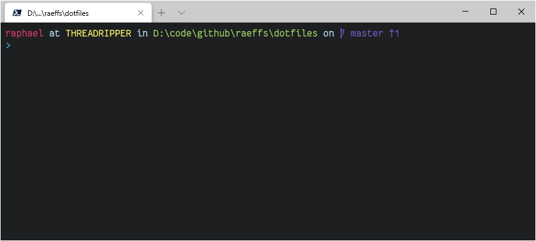

    

# Raphael's dotfiles

> Your dotfiles are how you personalize your system. These are mine.

This repository contains the configuration of my development environment.

## What's included?

- 7Zip
- Chocolatey (used to install most of the other packages)
- Docker Desktop
- Git and git-extras
- Windows Terminal

## How to use it?

🔞 If you want to give it a try, fork this repository, review the code, and remove things you don't want or need. You should not blindly use my settings. Use at your own risk! 😈

Run the `configure.ps1` script in a powershell with admin rights. The script can be run multiple times, if something is already installed it will be updated to the latest version.

## Attributions

Icon made by <a href="http://www.freepik.com/" title="Freepik">Freepik</a> from <a href="https://www.flaticon.com/" title="Flaticon">www.flaticon.com</a>
